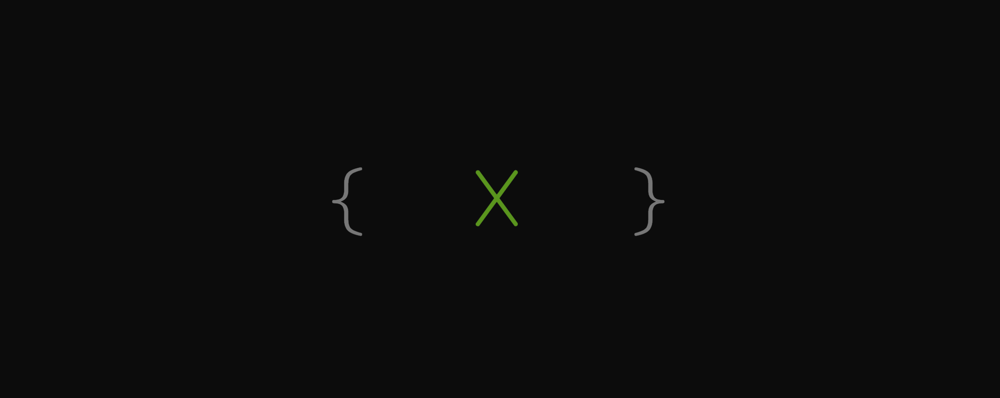

# About
[The Idea](http://the-x-company.surge.sh/)

This repository contains prototypes of the project "The X Company", a company in the blocks, automated and decentralized, where 90% decision-making will be automatically triggered by smart contracts with transparency.

Our mission is providing users great solutions with the LOWEST cost by replacing middlemen (or 3rd parties) and simplifying & automating operations.

In Coase’s 1937 essay ["The Nature Of The Firm"](http://www3.nccu.edu.tw/~jsfeng/CPEC11.pdf) asked why hire employees instead of contracting tasks?
His answer – a company exists because it is cheaper to do transactions within a company than outside.
And we believe that Blockchain has resurfaced this theory by dramatically reducing transaction costs and with the help of Blockchain and AI technologies, we can create the next generation of companies.
